### GraphQL

specification to implement FE and BE

agnostic to language, implement in
- any server
- any client - web, arduino, IoT


a spec, like JSON, 
comes with API structure

- can replace REST
- or can sit in front of a REST as a proxy


#### Intro

Prisma server (like GraphiQL)

GraphQL
- 1 endpoint
- returns only the data you requested

- typed: you have to specify types

Queries - pull data

Mutations - CRUD data

- simplifies relationships, 
    can be a tree of relationships
- self documenting


- GraphQL don't have queries, sort, filter like MySQL
- server implements "resolvers" that implements these

Prisma extras
- `where`


### Architecture recap

recap:

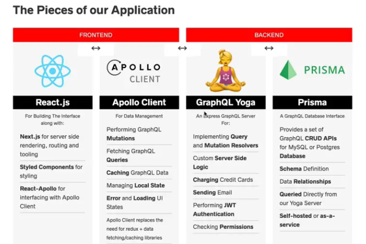

UI ---- GraphQL server ---- Prisma ---- DB


### Prisma setup

provides a set of Database Interface
simplifies GraphQL server development
generates the CRUD APIs
e.g. if we have a User field in our schema
it generates this for us

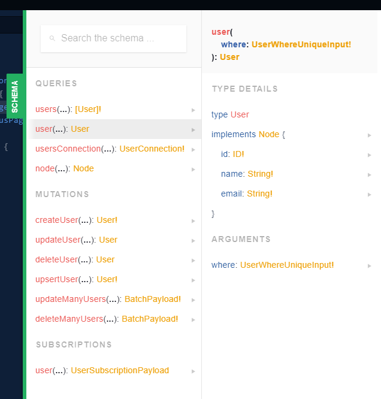


Setup:

> `npm i -g prisma graphql-cli`

from `prisma.yml`
put endpoint in an env variable
since we might change this in prod

Then,
```
> prisma login
> prisma init
```

we are using `variables.env` instead of default `.env`, so we need to specify 

> `prisma deploy --env-file variables.env`

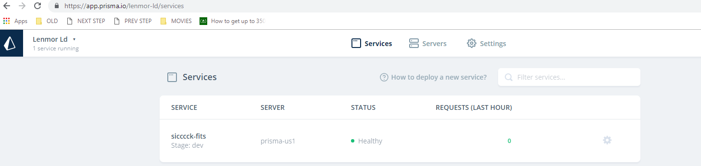

check out `prisma.graphql`
- this are the generated files for data models
basically our API
- adding fields to `datamodel.prisma` modifies these


#### GraphQL data types

Directives

- @uniqie, etc


Syntac
- ! means required
- [] array of something

someArray: [String!]!

someArray: [String]!


everytime we add something,
need to re-deploy

`npm run deploy`        // prisma deploy --env-file variables.env

changes are shown

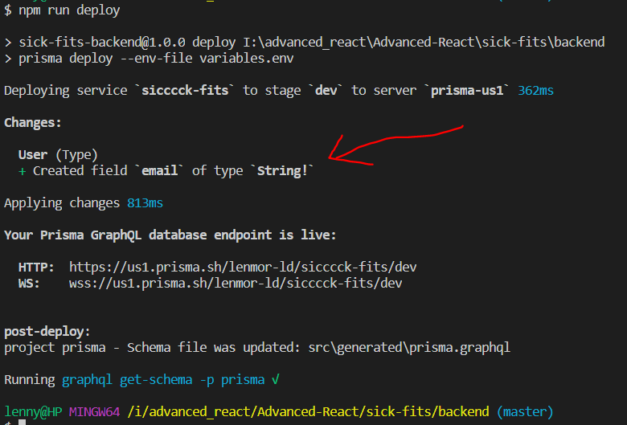


it also gives us a link to "GraphQL playground"

https://us1.prisma.sh/lenmor-ld/sicccck-fits/dev


Mutation: createUser

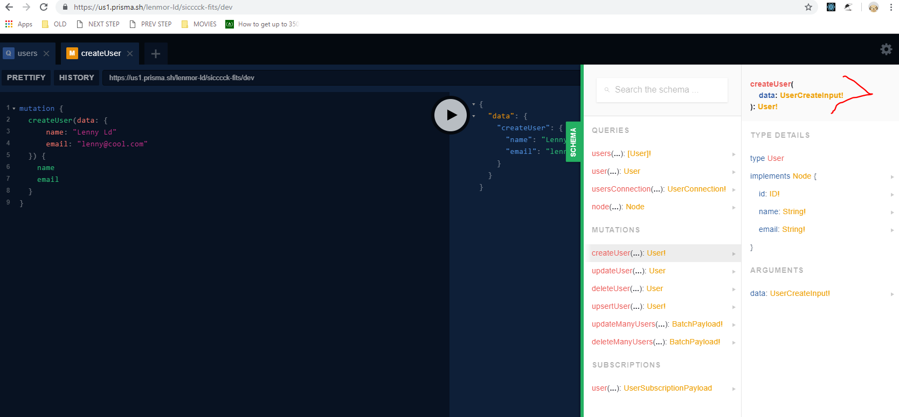


Test:
1. a user is created in Prisma dashboard

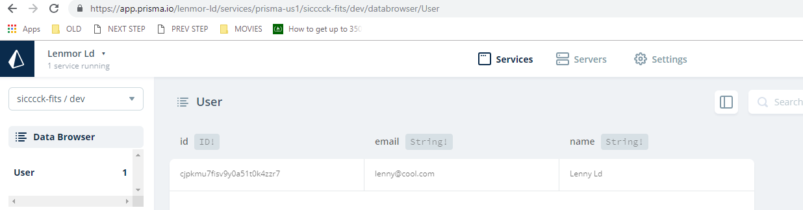


2. test in playground

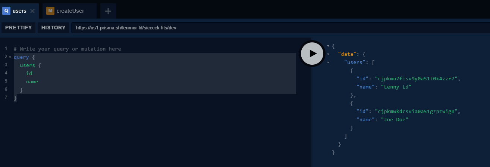

```
# Write your query or mutation here
query {
  users {
    id
    name
  }
}
```

```
# Write your query or mutation here
query {
  users(where: {
    name_contains: "len"
  }) {
    id
    name
  }
}
```


```
# Write your query or mutation here
query {
	usersConnection {
    pageInfo {
      hasNextPage
      hasPreviousPage
    }
    aggregate {
      count
    }
  }
}
```

we can see `hasNextPage`
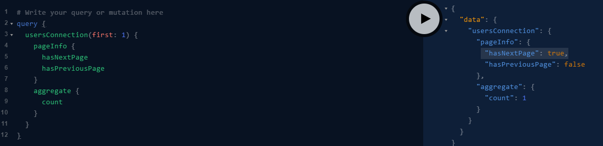


### GraphQL Yoga Server

Prisma generates the CRUD APIs
like the Query, Mutation s in `prisma.graphql`

we can't use these directly though
no security, auth layer
no custom layer logic

this is ONLY CRUD

#### GraphQL Yoga Server
- Express GraphQL Server
- Apollo Server
implement Query, Mutation resolvers


React.js    Apollo Client      GraphQL Yoga     Prisma

                        Node-express    MongoDB


#### resolvers

resolvers answers
- where does the data come from,
- what does this data do

2 kinds:
query, mutation resolvers


we're creating 2 grpahQL servers
both have their own typeDefs

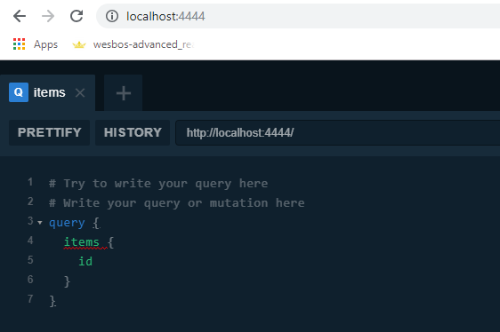

#### first query and mutation

take Prisma out of the equation to focus on GraphQL Yoga

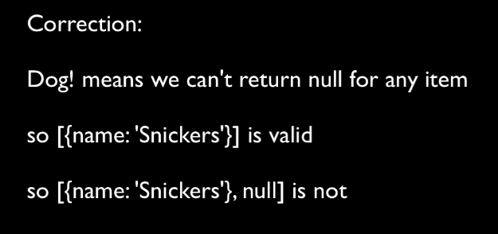

https://app.asana.com/0/947986908372180/947986908372183/f


#### Prisma Yoga Flow

Yoga Flow

[PRISMA]
1. Edit  data model -  (`datamodel.graphql`)
i.e. Prisma, backend

2. Deploy to Prisma - `npm run deploy` - (updates `prisma.graphql`)

i.e.,
`prisma.graphql` file generated based off
`datamodel.graphql`

[YOGA]
3. Edit `schema.graphql` for Yoga
i.e. `schema.graphql` is our public-facing API
only exposes a few Mutation and Query

4. write a resolver for Query/Mutation or both
`Mutation.js`, `Query.js`


To see what is available for us to use in the backend

1. open `prisma.graphql`, check for mutation/query needed
  e.g.l ItemsQuery, UsersQuery
2. check playground of backend

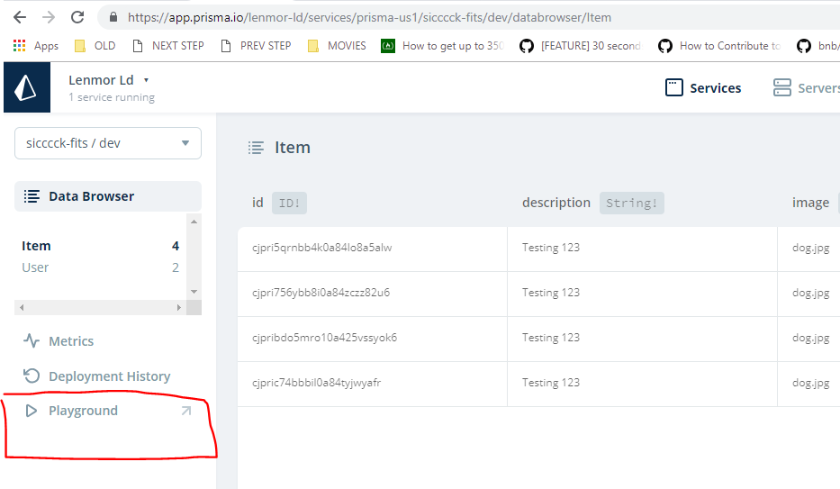

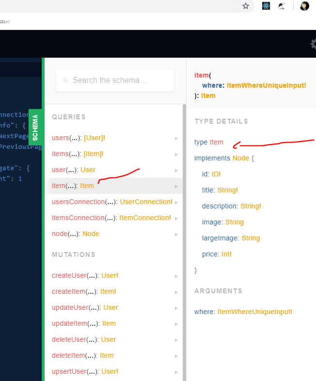

##### First mutaion

- in `schema.graphql`, we need Item schema
import from `prisma.graphql` using Prisma import
which looks like a comment

```
# import * from './generated/prisma.graphql'

type Mutation {
  ...
```

accessing db from resolver Mutation.js
`const item = ctx.db`

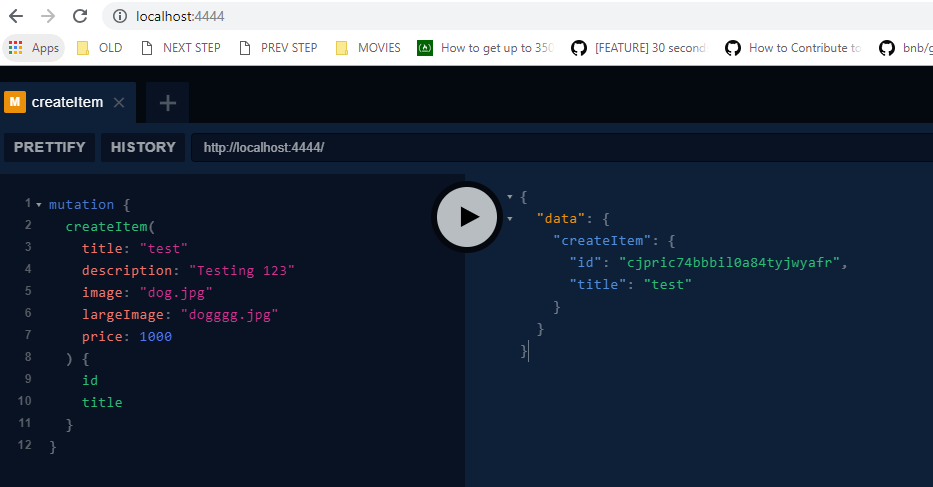

Verify if item added to backend

access prisma backend
$ `prisma console`    # this opens browser

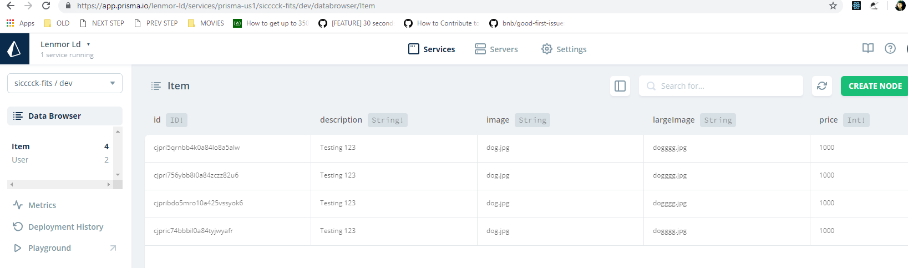


#### First Query

debugging

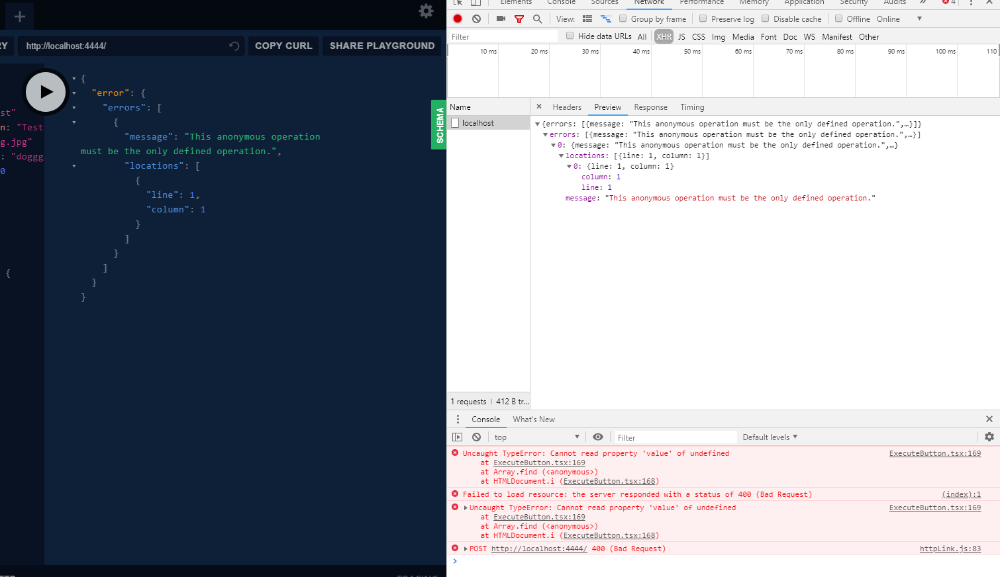


add name to mutation?

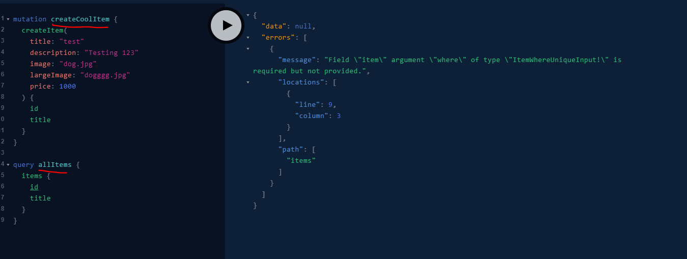

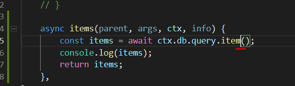

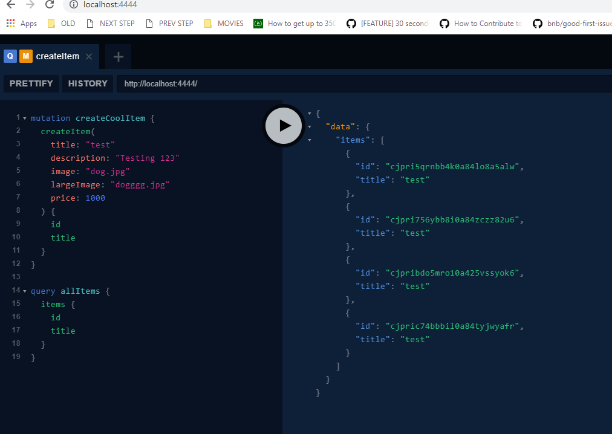


#### If same query ...
If query exactly the same in 
Prisma and Yoga

- make a query, but it's just pulling a list
no filters, auth, custom logic

- forward query Prisma to Yoga