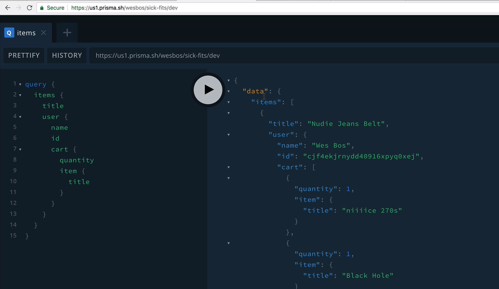
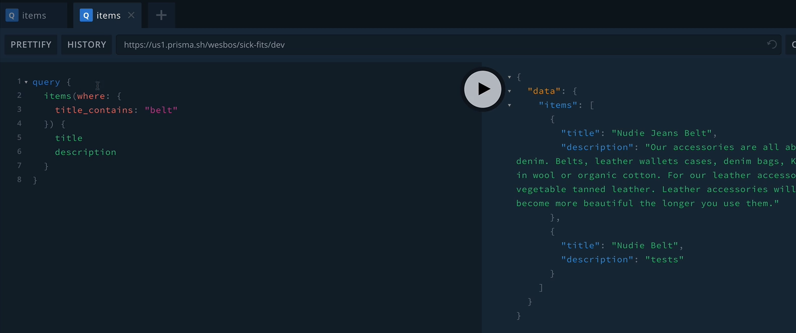

### GraphQL

specification to implement FE and BE

agnostic to language, implement in
- any server
- any client - web, arduino, IoT

a spec, like JSON, 
comes with API structure

- can replace REST
- or can sit in front of a REST as a proxy

#### Intro

Prisma server (like GraphiQL)

GraphQL
- 1 endpoint
- returns only the data you requested

- typed: you have to specify types

Queries - pull data

Mutations - CRUD data

- simplifies relationships, 
    can be a tree of relationships
- self documenting

- GraphQL don't have queries, sort, filter like MySQL
- server implements "resolvers" that implements these

Prisma extras
- `where`

