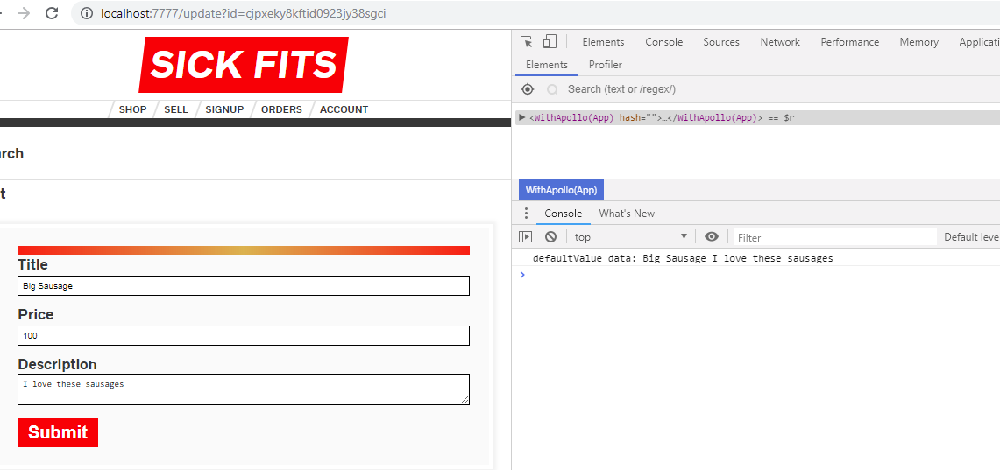
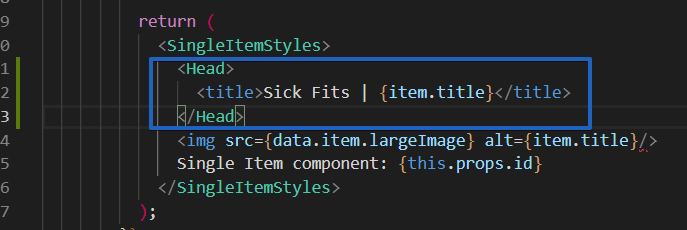
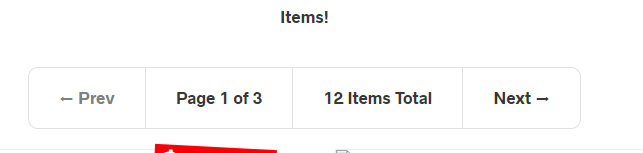

#### Client-side GraphQL

ways to handle data in a React application

1. store in a Component, using `state`
   pass down to other components, using

   a. `props`
   b. `context`

2. Redux - state management, data store, actions

3. Apollo Client

   - replaces Redux for data management

   1. fetch data from server side
   2. push data to server via mutations
   3. caching (e.g. requesting same data twice)
   4. error catching, loading UI states

##### Apollo Client

vs Relay (more low-level)

Apollo boost:

- some pre-config'ed good stuff useful when dev'ing with Apollo Client

Next-with-Apollo:

- HoC exposing Apollo Client, needed since we're using Next's SSR

`withData.js`

- sort of an express middleware

###### Apollo Dev Tools

- very useful to see **cache**


Tip:
Locate queries in actual files
where you will be doing the query

If needed in multiple places, refactor it out

###### Apollo HoC vs render-prop

before:

```
class Items extends Component {...}
...

export default withItems(Items);

// this will expose a list of items via a prop

```

now, render-props with `Query`

\*\* Hey Query, here's a query
and here's a function (render prop)
that will do something with your `payload` result

```
class Items extends Component {
    render() {
        return (
            <div>
                <p>Items!</p>
                <Query query={ALL_ITEMS_QUERY}>
                    {
                       (payload) => {
                            console.log(payload);
                            return <p>Hey i'm the child of query</p>
                       }
                    }
                </Query>
            </div>
        );
    }
}
```


3 things we're interested in the `payload`

- data
  returned from the query
- error

- loading
  flips to true when doing some sort of work
  usually false since we are using SSR

### destructuring

before:

```
{
    (payload) => {...}
}
```

after:

```
{
    ({data, error, loading}) => {...}
}
```


we never query `__typename = "Item"`
but generated by apollo

####### some react router stuff

\*Item.js

```
<Link href={{
    pathname: '/item',
    query: { id: item.id }      // /item?id=blah123
}}>
    <a>{item.title}</a>
</Link>
```

```
<Link href={{
    pathname: "update",
    query: { id: item.id }
}}>
    <a>Edit </a>
</Link>
```

##### createItem mutation


Mutation, with render prop

```
      <Mutation mutation={CREATE_ITEM_MUTATION} variables={this.state}>
        {(createItem,
            { loading, error }) => (
          <Form
            ...
          </Form>

        )}
</Mutation>
```

we are exposing
`(createItem, { loading, error })`

error: render using `ErrorMessage` component

loading:

- stop user from typing when loading
- disable `fieldset`
- Apollo flips loading var on/off for us


Redirecting

#### 19. uploading images

Cloudinary

- image hosting
- 10GB free

setup to upload directly from client
without a middle layer

Settings > Upload > Add upload preset


`"https://api.cloudinary.com/v1_1/dvfhgkkpe/image/upload"`

observe Reaect dev tools
while uploading


we can see the state come back

### submitting works now too


SHOP


EDIT PRESET - auto height
500 - auto


#### Updating items - query and mutation

schema.graphql

**Query resolver**

`item(where: ItemWhereUniqueInput!) : Item`

same as

`item(id: id!)`

but it's better to stay consistent with
prisma.graphql


**Mutation resolver**

```
	updateItem(parent, args, ctx, info) {
		// first take a copy of the updates
		const updates = { ...args};
		// remove the ID from the updates
		delete updates.id;
		// run the update method
		return ctx.db.mutation.updateItem(
			{
				data: updates,
				where: {
					id: args.id.
				},
			},
			info            // return this
		);
	},
```

**Frontend**

update.js

props passed to Sell


Sell > UpdateItem


**UpdateItem.js**

must enclose Mutation inside Query

```
	render() {
		return (
			<Query query={SINGLE_ITEM_QUERY} variables={{ id: this.props.id }}>
				{({ data, loading }) => {
					return (
						<Mutation mutation={UPDATE_ITEM_MUTATION} variables={this.state}>
							{(createItem, { loading, error }) => (
```

`defaultValue={data.item.title}`

defaultValue:
allows to set input box to some text
without tying it to state
since we want to mirror the input to state only when changed




after submitting async `updateItemMutation`
it's nice that we get a clear error


this is from `<Error error={error}`

we have to match mutation params
with the schema


_strict typing_

even though we are passing id here


id will be ignored here, if we don't put it
in the arguments


### CRUD Flow

BACKEND

1. Add to schema: `schema.graphql`
2. Add to resolver: `Query.js` or `Mutation.js`

UI

1. Add to UI - e.g. Create/Delete/Edit button and forms
2. Component- e.g. `DeleteItem.js`
3. Mutation - `DELETE_ITEM_MUTATION`
   which calls the ones in schema
4. in `render()`, use render props to enclose UI with
   Mutation/Query

   ```
   <Mutation mutation={DELETE_ITEM_MUTATION}
             variables={{ id: this.props.id }}>
               {() => (
                   <button
                        onClick={() => deleteItem}
                    >...
               )}
   ```

commits:
4_20_Backend DeleteItem
4_20_Frontend DeleteItem

##### Delete Item

Raw GraphQL query
`const item = await ctx.db.query.item({ where }, ' id title ');`

it works, but doesn't refresh the lis of items
have to do a manual refresh to show updated

**cache invalidation**

deleted in backend
but not deleted in cache

options:

1. manually delete in cache
2. prefetch query in home page
3. just delete that item from current page

-> delete in cache

read cache in update funcion
i.e., must get all these items


we can use `ALL_ITEMS_QUERY` in Items.js


WORKS!


##### Item page

1. check in schema: `item(where: ItemWhereUniqueInput!): Item`

2. check in prisma backend: 
```
input ItemWhereUniqueInput {
  id: ID
}
```
it accepts just an ID

3. check resolver
Query.js: `item: forwardTo('db'),`
no extra work needed


`pages/item.js`
renders
`components/SingleItem.js`


Handling no item found:
component still loads even if there is no item found


1. server side - custom resolver
if no item found, throw error
display message in UI

2. client side - `if (!data.item)`


#### updating <title> for current item

need to update meta
using Next.js **side-effects**
we can have multiple head tags throughout app

possible to do this:




CSS 
```
	img {
		width: 100%;
		height: 100%;
		object-fit: contain;
	}
```

if extermely wide and short
or tall and wide
`object-fit: contain` will fit it in


##### Pagination

- we don't want to write a query to fetch 1000 items
- neither get the IDs of 1000 items, and split

**Prisma connections**

######## Backend

`prisma.graphql` - we have `ItemConnection`

1. `schema.graphql` 

```
type Query
...
    itemsConnection(where: ItemWhereInput): ItemConnection!
```


2. `Query.js` resolver

```
const Query = {
    ...
    itemsConnection: forwardTo('db'),
}
```


to test new connection


* useful for infinite scroll (e.g. 9gag, pinterest)

######## Frontend


Pagination query


```
const PAGINATION_QUERY = gql`
	query PAGINATION_QUERY {
		itemsConnection {
			aggregate {
				count
			}
		}
	}
`;
```

```
const Pagination = props => (
	<PaginationStyles>
		<Query query={PAGINATION_QUERY}>
			{({ data, loading, error }) => {
				if (loading) return <p>Loading...</p>
				return (
				<p>pagination {data.itemsConnection.aggregate.count}</p>
			)}
		}
		</Query>
	</PaginationStyles>
)
```


`config.js`
- items per page


`http://localhost:7777/items?page=2`
props: page=2

to get the props

1. page -> Items

`pages/index.js`
```
<Items page={parseFloat(props.query.page) || 1}/>
```

if first page, default to 1

2. Items -> Pagination

`Items.js`

```
<Pagination page={this.props.page}></Pagination>
```

2. Pagination component has access to this now


Title bar


Previous Link

```
    <Link
        prefetch
        href={{
            pathname: 'items',
            query: { page: page - 1 },
        }}
    >
        <a>⬅️ Prev</a>
    </Link>
```

**prefetch** attrib on Link:
- in prod. it prerenders both previous and forward pages
- instant pagination results


Next, Prev links




### updating Items on page next, prev

##### more specific schema Query

`items(where: ItemWhereInput, orderBy: ItemOrderInput, skip: Int, first: Int): [Item]!`

using skip, first:
e.g. items 5-8