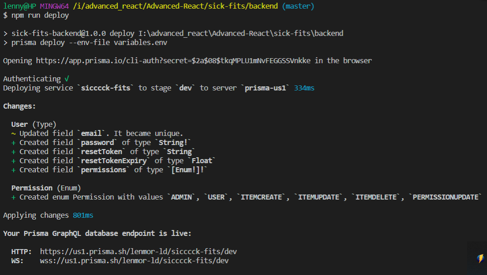
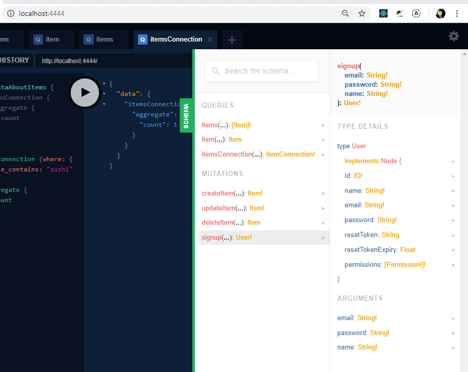
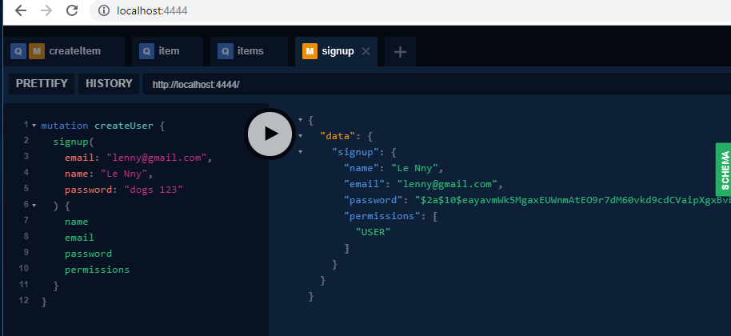
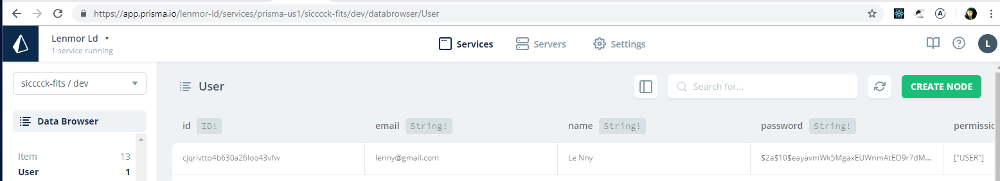

# Module 5

## Episode 24 - User signup and Permission Flow


1. add permissions in `datamodel.graphql`

add an enum of permissions

2. since we changed User backend schema, delete users in DB through prisma UI, then

`npm run deploy`



3. update GraphQL schema

`schema.graphql`
...
`signup(email: String!, password: String!, name: String!): User!`
...

User defined in `prisma.graphql`
it will take that shape

4. resolver

**Must allow Yoga Server to use cookies**
- when creating a user, set a cookie with the currently logged in user 
every single time someone requests a page
cookie is sent along with a JWT

JWT - allow us to validate user
(like sessions)

**why Using cookies**

put JWT in 

cookies vs local_storage

TL;DR
cookies - to server-render logged in user

cookies - send along JWT for every request, 
		to enable SSR of the logged in parts
local storage - also possible 
	For each request, pull JWT from localStorage 
	and send it along with the ride to backend, so backend could auth before delete, update, etc
	
	But for SSR, localStorage doesn't automatically send it along

	e.g. if page is refreshed, it can't server-render the logged-in parts
	2 sec glitch that logout view renders, and it will re-render on server
	when it realizes you have localStorage JWT


	**hashing**
```
		// args.password = 'dogs123';   // NOOO! PLAINTEXT!!! hash it

		// hashing
		hash('dogs123')			//k1j23lknlk4h12jk312312h3b12k3j
		hash('dogs123')  === // k1j23lknlk4h12jk312312h3b12k3j

		//  - not reversible
		hash('dogs12') = //j4kl3n64b5kj51g234b343
```

**salting**

adds randomness

otherwise
```
mdb('dogs123')		// asdf
mdb('dogs123')		// asdf					// ATTACKER
```


Testing:

Schema: 


Sample mutation:


Prisma console:

=========